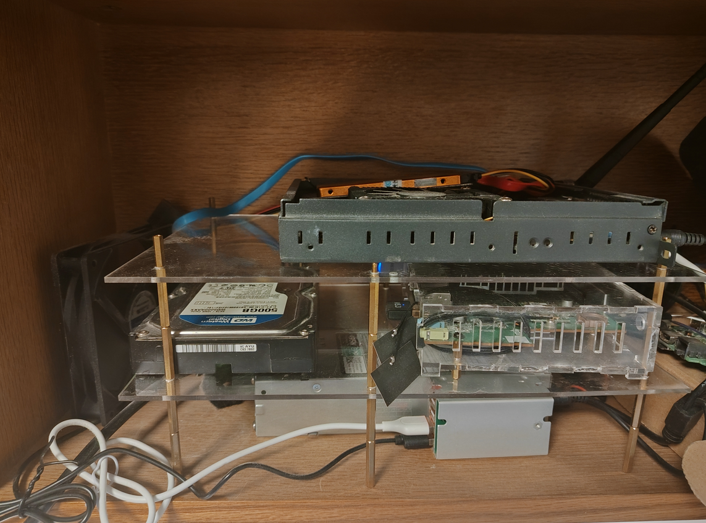
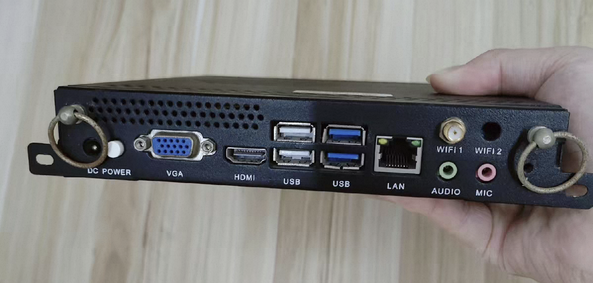
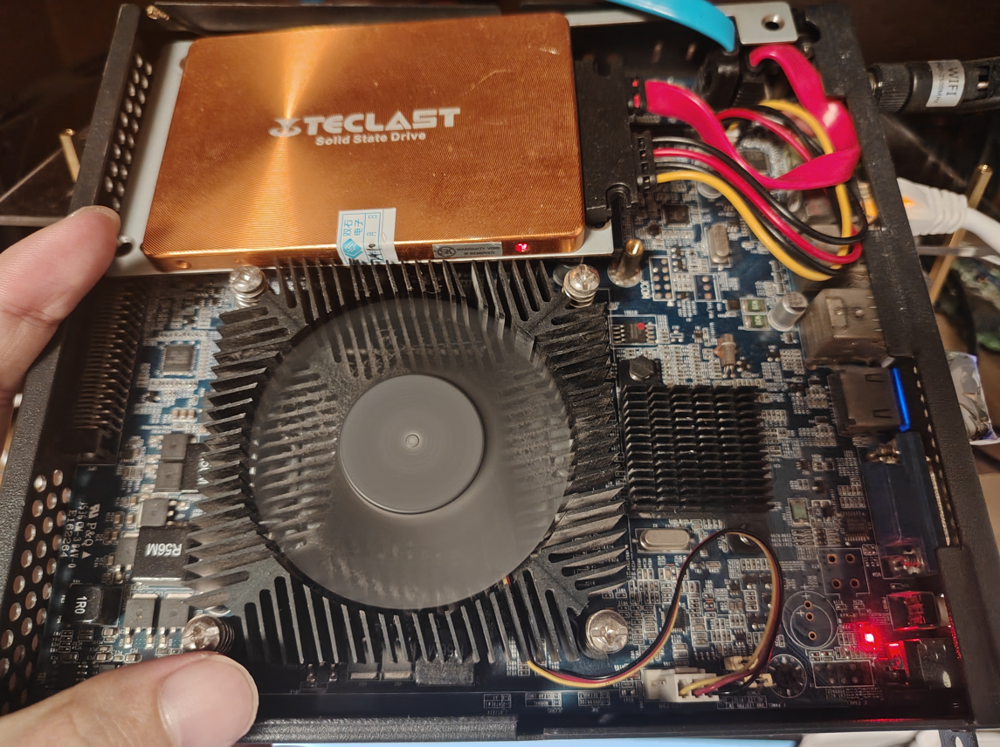

# DiyNAS

古法炮制一个NAS，可以保存图片、电影，作为Zotero的webDAV备份盘，手机端可以查看等等

## 硬件清单

事情的起因是从旧的台式机上拆下了一块500GB的机械硬盘，秉持着废物利用的原则，于是就有了制作一个NAS的想法，为什么不直接插在台式机上呢？因为500G实在是食之有味，弃之可惜，占机箱空间不说，增加的存储量也没有多少。

于是就有了开局一块硬盘，装备全靠捡（垃圾）。

NAS 的小主机是从咸鱼上淘的工控小主机，应该是个ops小主机，图片如下，接口是挺全的。

依旧伊拉克战损版...

拆开这个小主机，发现只有两个SATA接口，一个口还是接上了系统盘，是不是该庆幸只剩下一个SATA口接机械硬盘呢？

蓝色的SATA线是延长到机械硬盘的线。

除了硬盘、小主机，还需要电源和机械硬盘的散热，电源选用的是服务器电源，475W嘎嘎猛，可以引出12V的直流电，散热随便找的5V机箱风扇，给硬盘散热戳戳有余。至此，硬件准备完毕~

---

## 装系统

其实市面上有很多线程的NAS系统了，比如黑群晖、飞牛等等，但是秉持着自由度最大化的原则，采用的是 Ubuntu+Docker+NextCloud的配置方案。

