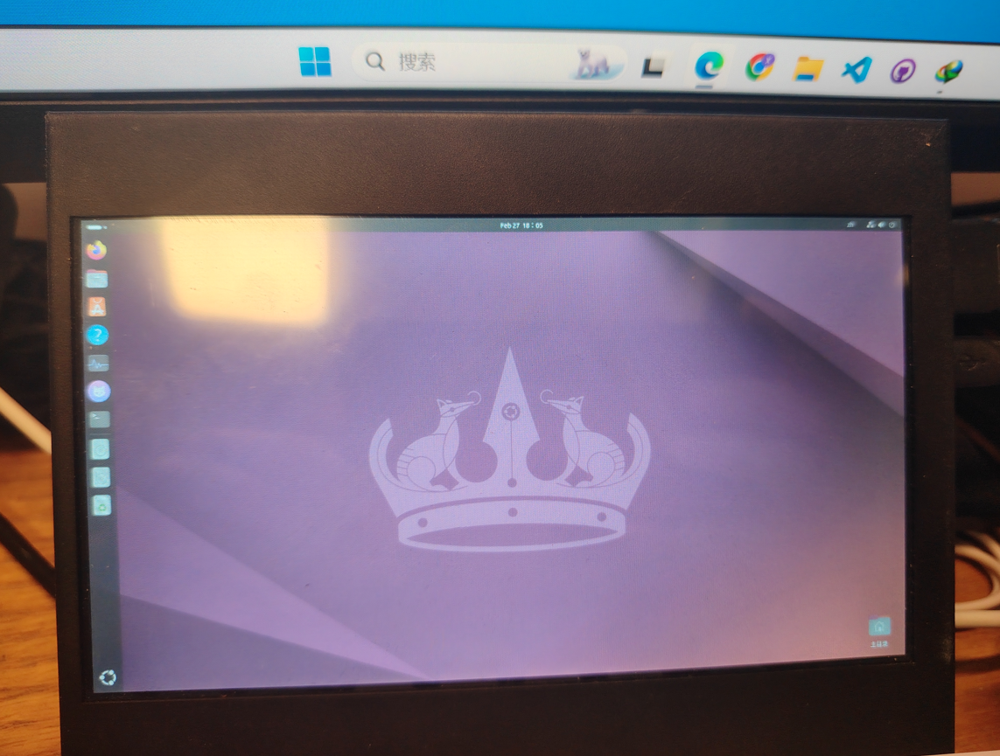
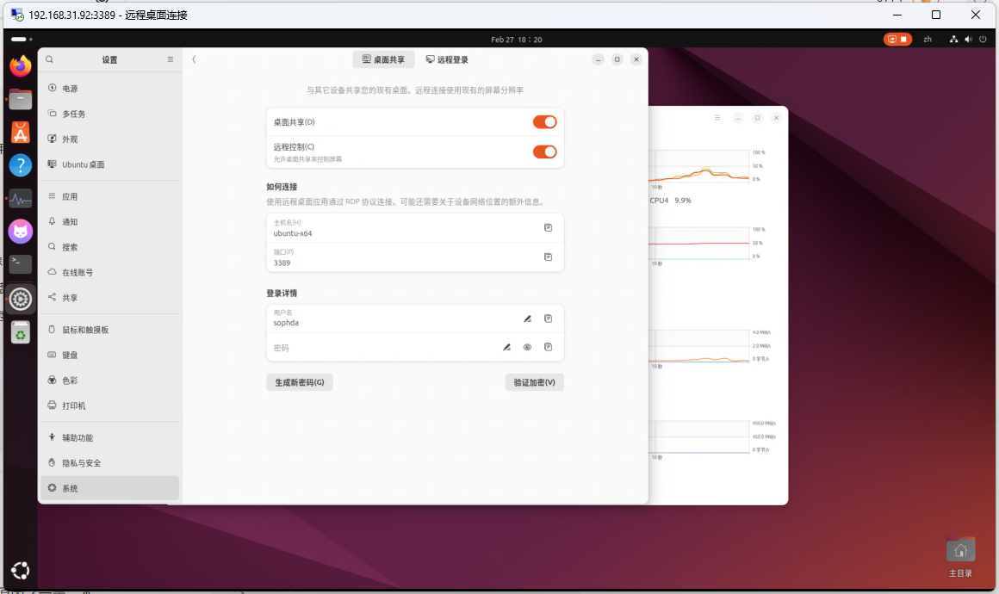
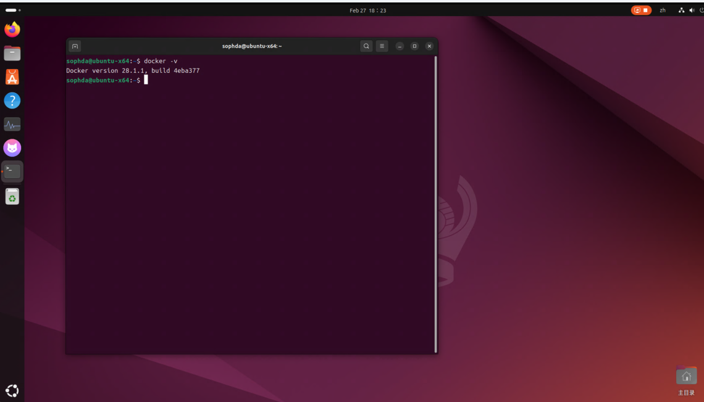
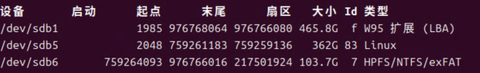
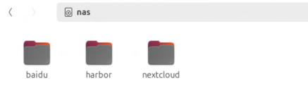
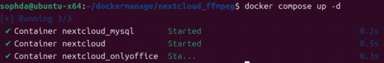
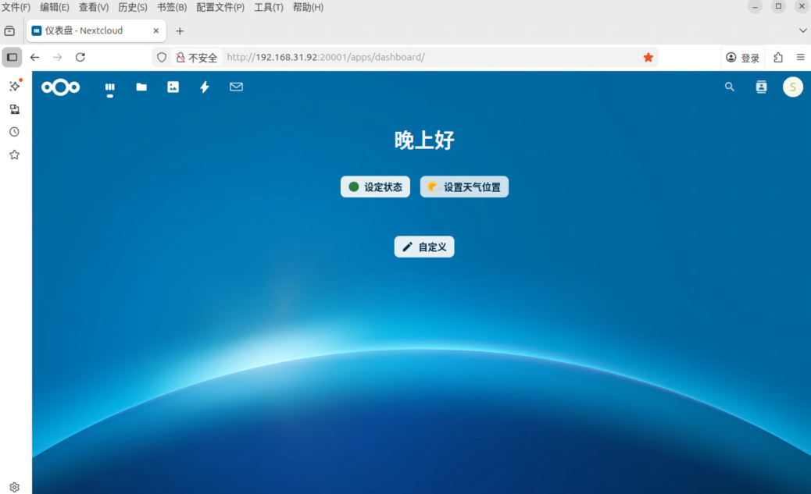
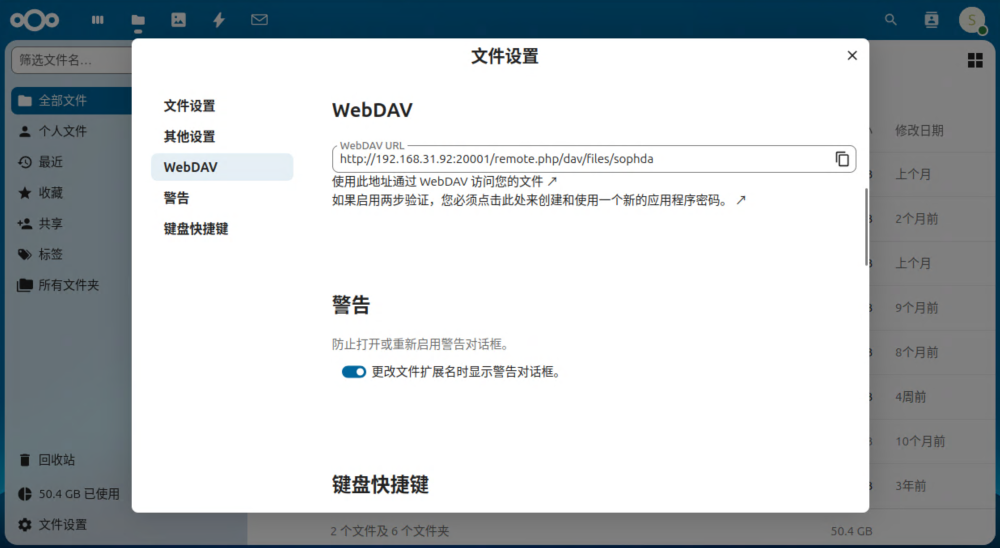

# DiyNAS

古法炮制一个NAS，可以保存图片、电影，作为Zotero的webDAV备份盘，手机端可以查看等等


## 硬件清单

事情的起因是从旧的台式机上拆下了一块500GB的机械硬盘，秉持着废物利用的原则，于是就有了制作一个NAS的想法，为什么不直接插在台式机上呢？因为500G实在是食之有味，弃之可惜，占机箱空间不说，增加的存储量也没有多少。

于是就有了开局一块硬盘，装备全靠捡（垃圾）。

NAS 的小主机是从咸鱼上淘的工控小主机，应该是个ops小主机，图片如下，接口是挺全的。

依旧伊拉克战损版...


拆开这个小主机，发现只有两个SATA接口，一个口还是接上了系统盘，是不是该庆幸只剩下一个SATA口接机械硬盘呢？

蓝色的SATA线是延长到机械硬盘的线。


除了硬盘、小主机，还需要电源和机械硬盘的散热，电源选用的是服务器电源，475W嘎嘎猛，可以引出12V的直流电，散热随便找的5V机箱风扇，给硬盘散热戳戳有余。至此，硬件准备完毕~

---


## 装系统

其实市面上有很多线程的NAS系统了，比如黑群晖、飞牛等等，但是秉持着自由度最大化的原则，采用的是 Ubuntu+Docker+NextCloud的配置方案。

---

> 首先安装好Ubuntu系统，这里使用的是Ubuntu24.04，然后使用rufus工具随便烧录一个U盘

安装成功后，可以看到如下界面：



配置一下远程桌面，就可以在远程主机上通过RDP控制这台小主机了：




## 装docker

直接在网上找一个安装的教程，安装好。

```
# 1. 下载官方安装脚本并使用阿里云镜像源
curl -fsSL https://get.docker.com | bash -s docker --mirror Aliyun
# 2. 启动 Docker 服务并设置开机自启
sudo systemctl enable --now docker
# 3. 验证安装是否成功
sudo docker run hello-world
```




## 安装next cloud

编写如下的yml文件，作用是：

- 从nextcloud_ffmpeg这个镜像创建容器
- 将磁盘的数据库，服务等映射到本地磁盘，实现持久化存储。
- 加载OnlyOffice服务

```
services:
  # 数据库服务
  db:
    image: mysql:latest                       # 使用最新版本的 MySQL 镜像
    container_name: nextcloud_mysql           # 自定义容器名称
    restart: always                           # 容器异常退出时自动重启
    environment:
      MYSQL_ROOT_PASSWORD: 666 # 定义 MySQL 的 root 用户密码
      MYSQL_PASSWORD: 666           # 定义 Nextcloud 用户的密码
      MYSQL_DATABASE: nextcloud               # 创建数据库，名为 nextcloud
      MYSQL_USER: nextcloud                   # 定义 MySQL 用户名
      TZ: Asia/Shanghai                       # 设置时区为上海
    volumes:
      - /home/sophda/d/nextcloud/db_data:/var/lib/mysql  # 将 MySQL 数据存储在主机的指定目录，实现持久化存储
    networks:
      - nextcloud_network                     # 连接到指定的网络

  # Nextcloud 应用服务
  app:
    image: nextcloud_ffmpeg:latest                   # 使用最新版本的 Nextcloud 镜像
    container_name: nextcloud                 # 自定义容器名称
    restart: always                           # 容器异常退出时自动重启
    depends_on:
      - db                                     # 确保 db 服务先启动
    environment:
      MYSQL_DATABASE: nextcloud               # 使用与数据库服务相同的数据库名称
      MYSQL_USER: nextcloud                   # 使用与数据库服务相同的用户名
      MYSQL_PASSWORD: 666           # 使用与数据库服务相同的密码
      MYSQL_HOST: db                          # 数据库主机名为 db（即 db 服务）
      TZ: Asia/Shanghai                       # 设置时区为上海
    volumes:
      - /home/sophda/d/nextcloud/nextcloud_data:/var/www/html  # 将 Nextcloud 数据存储在主机的指定目录，实现持久化存储
    ports:
      - "20001:80"                             # 将容器的 80 端口映射到主机的 8080 端口
    networks:
      - nextcloud_network                     # 连接到指定的网络

  # OnlyOffice 文档服务
  onlyoffice:
    image: onlyoffice/documentserver:7.1.0     # 使用指定版本的 OnlyOffice 镜像
    container_name: nextcloud_onlyoffice       # 自定义容器名称
    restart: always                           # 容器异常退出时自动重启
    environment:
      JWT_ENABLED: 'false'                    # 关闭 JWT（无需密钥）
      JWT_SECRET:                             # 不设置 JWT 密钥
      TZ: Asia/Shanghai                       # 设置时区为上海
    ports:
      - "20002:80"                             # 将容器的 80 端口映射到主机的 8081 端口
    networks:
      - nextcloud_network                     # 连接到指定的网络

# 网络定义
networks:
  nextcloud_network:                          # 定义一个名为 nextcloud_network 的网络
#	external: 'true'
# 卷定义，用于持久化存储数据
volumes:
  mysql_data:                                 # 定义 MySQL 数据的卷
  nextcloud_data:                             # 定义 Nextcloud 数据的卷


```

---

对于nextcloud_ffmpeg镜像的制作，主要是在nextcloud镜像的基础上增加一个ffmpeg的库，这样在上传好视频文件后就可以看到视频预览图了。

```
FROM nextcloud:latest
LABEL maintainer="engr-z"

RUN apt update && apt upgrade -y
RUN apt install ffmpeg smbclient libsmbclient-dev -y
RUN pecl install smbclient
RUN docker-php-ext-enable smbclient

```


## 磁盘映射

按照docker yml文件的定义，持久化存储映射的地址是在`/home/sophda/d`这个地址，那么就需要将磁盘映射到这个路径下。

首先查看机械硬盘的磁盘分区和名称：

```
fdisk -l
```



根据大小可以判断`/dev/sdb5`是机械硬盘。

将硬盘挂载到指定的路径：

```
sudo mount /dev/sdb5 /home/sophda/d
```

然后就可以 在`/home/sophda/d`目录下看到硬盘的内容了（挂载后的d文件夹右上方会有个硬盘的标）：




## docker，启动！

来到`docker-compose.yml`目录下，执行命令：

```
docker compose up -d
```

> 这个d表示后台运行，不占用当前的shell



---

简单注册个用户，然后打开浏览器就可以享用了~



---

打开文件设置->webDAV，将地址填入zotero等软件，还可以多端同步备份




## 硬盘挂载失效

因为机械硬盘好多年了，不太稳定，偶尔会有硬盘挂载失效的问题。

硬盘出了问题后，映射的路径是空的，这时候运行的容器无法加载保存的数据，点进去next cloud会让重新初始化。

这个时候需要删除所有在运行的容器，删除d目录下容器创建的内容，然后重新执行挂载，启动docker。

---

- 查看正在运行的容器：

```
docker ps
```

- 删除容器

```
docker rm 容器id
```

---

确保d路径没有挂载后：

```
cd d
rm -rf ./*
```

---

重新执行挂载，然后compose启动容器，当docker发现映射的路径d里面有之前存储的数据时，新容器会自动加载之前保存的数据。
