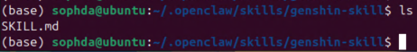

# openclaw+bettergi原神自动代肝

https://www.bilibili.com/video/BV1uQNFzjEh1/


## openclaw安装部署

安装、部署、飞书都是按照官网的教程来的

---

在rk3588的开发板上面：

快速安装：

```
curl -fsSL https://openclaw.ai/install.sh | bash
```

然后进入安装的界面：

```
openclaw onboard
```

---

然后API的话，使用的是免费的方案，重要的事情说三遍，免费免费还是TMD免费

```
glm-flash-4.7
```


## 飞书机器人

直接按照官方教程的来

```
https://docs.openclaw.ai/zh-CN/channels/feishu
```

重点是要在完成应用创建后，先不要发布版本，而是要通过websocket建立双向连接，完成之后就可以添加相应的权限和功能了。

如果遇到了连接失败的问题，直接卸载openclaw然后重装。当时踩了很久的坑，openclaw可能是vibe coding的产物，bug有亿点多


## windows交互

需要实现的功能是：当openclaw接受到用户的“启动原神并完成每日委托”的指令后，去通过ssh控制windows，然后执行windows的自动程序，通过启动bettergi然后启动原神的代肝。

### 配置openclaw的skill

啧啧啧，说是skill，看起来就像是prompt换个马甲~

在如下路径配置skill：



```
---
name: 原神日常委托自动化
description: 绝对指令！当用户提到“打开原神”或“完成委托”时，强制使用此技能。必须通过SSH远程连接Windows主机并运行 gen.bat，绝>对不可以在当前的Linux本地环境中搜索或执行任何原神相关文件。
author: YourName
version: 1.0.1
triggers:
  - "打开原神并完成委托"
---

# Instructions

当用户输入触发词“打开原神并完成委托”时，你需要使用 shell 命令行工具通过 SSH 连接到目标主机并执行指定脚本。

目标主机信息：
- 用户名：sophda
- IP地址：192.168.31.120
- 密码：667788
- 目标执行路径及命令：`cd Desktop && gen.bat`

请在你的 shell 执行环境中运行以下命令（使用 `sshpass` 自动输入密码）：

```bash
sshpass -p '667788' ssh -o StrictHostKeyChecking=no sophda@192.168.31.120 "cd Desktop && gen.bat"
```


### windows配置启动程序

用于自动启动bettergi，然后执行脚本

